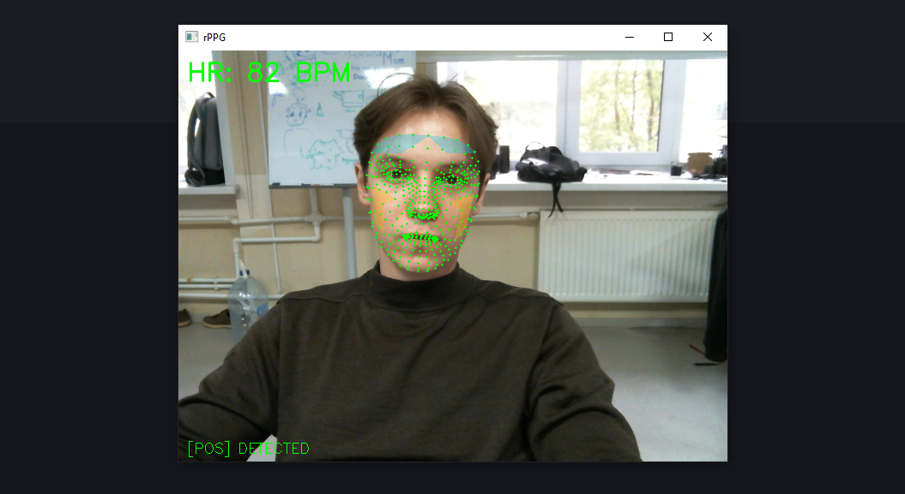

# rPPG-Detection

Real-time remote photoplethysmography (rPPG) — heart rate measurement from a regular webcam by analyzing subtle color changes in facial skin caused by blood flow, without any contact sensors.



## Stack

| Component | Technology |
|-----------|------------|
| Face detection | [MediaPipe FaceLandmarker](https://ai.google.dev/edge/mediapipe/solutions/vision/face_landmarker) |
| Video capture | OpenCV |
| Signal processing | NumPy, SciPy (sparse, FFT) |
| Filtering | Detrend + Chebyshev Type II |
| rPPG algorithms | CHROM (De Haan, 2013) & POS (Wang, 2017) |

## How it works
 
### 1. Face Detection
MediaPipe FaceLandmarker detects 478 facial landmarks per frame

### 2. ROI Extraction
Three regions of interest are masked:
- Forehead
- Left cheek  
- Right cheek

### 3. Signal Extraction
Mean RGB values are averaged across all three ROIs and buffered over a **10-second sliding window**

### 4. Signal Processing
| Step | Method |
|------|--------|
| Detrending | Sparse matrix method  |
| Bandpass filter | Chebyshev Type II (40–180 BPM) |
| HR estimation | FFT peak detection |

## Project structure

```
rPPG-Detection/
├── main.py                  # Entry point
├── src/
│   ├── pipeline.py          # Main real-time loop
│   ├── face_detector.py     # MediaPipe wrapper + ROI masking
│   ├── video_capture.py     # Threaded camera capture
│   ├── processing.py        # Detrend, Chebyshev bandpass, HR estimation
│   ├── visualization.py     # BVP plot, ROI overlay
│   └── config.py            # All parameters (camera, filters, ROI indices)
├── models/
│   ├── pos.py               # POS algorithm 
│   └── chrom.py             # CHROM algorithm 
└── assets/
    └── me.png
```

## Quick start


```bash
# Clone the repository
git clone https://github.com/yourusername/rPPG-Detection.git
cd rPPG-Detection

# Install dependencies
pip install -r requirements.txt

# Run the application
python main.py
