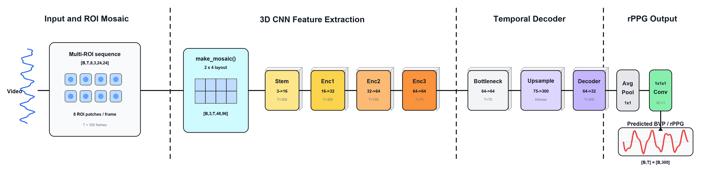

# rPPG Detection

Проект для восстановления удаленного фотоплетизмографического сигнала по видео лица. Система выделяет информативные участки кожи, отслеживает слабые изменения цвета во времени и формирует одномерный rPPG/BVP-сигнал, который можно использовать для последующей оценки частоты сердечных сокращений.



## Кратко

`rPPG Detection` объединяет классические методы анализа цвета кожи и нейросетевой подход на основе 3D-сверток. Основной сценарий работы строится вокруг multi-ROI представления: вместо обработки всего лица модель получает несколько небольших патчей с областей, где пульсовая компонента обычно выражена стабильнее.

```text
Видео лица
  -> landmarks лица
  -> ROI-области кожи
  -> последовательность RGB-патчей
  -> multi-ROI PhysNet
  -> rPPG/BVP-сигнал
  -> оценка HR через спектр
```

## Стек

| Компонент | Назначение |
| --- | --- |
| `Python` | основной язык проекта |
| `PyTorch` | нейросетевая модель `PhysNet` и тензорные вычисления |
| `OpenCV` | работа с видео, камерой и визуализацией |
| `MediaPipe` | детекция лица и facial landmarks |
| `NumPy` | обработка массивов и сигналов |
| `SciPy` | фильтрация, detrending и спектральная обработка |

## Данные

Модель работает с окнами видео, преобразованными в набор ROI-патчей.

В одном `.npz`-окне хранятся:

```text
patches: [time, roi, h, w, 3]
ppg:     [time]
```

Перед подачей в модель патчи переставляются в формат PyTorch:

```text
[batch, time, roi, 3, h, w]
```

Текущие параметры из `src/config.py`:

```text
FPS_TARGET      = 30
CNN_WINDOW      = 300
MULTI_ROI_COUNT = 8
ROI_PATCH_SIZE  = 24
```

Типичный вход `PhysNet`:

```text
[B, 300, 8, 3, 24, 24]
```

## Архитектура модели

Основная модель находится в `models/physnet.py`. Она принимает последовательность из 8 RGB ROI-патчей на каждом временном шаге и предсказывает одномерный BVP-сигнал той же временной длины.

### 1. Multi-ROI Mosaic

Сначала 8 ROI-патчей собираются в единую пространственную мозаику `2 x 4`:

```text
[B, T, 8, 3, 24, 24]
  -> [B, 3, T, 48, 96]
```

Так модель может применять `Conv3d` сразу по цветовым каналам, времени и пространству ROI-мозаики.

### 2. 3D CNN Encoder

Блок извлечения признаков состоит из `Stem` и трех encoder-блоков:

```text
Stem: Conv3d 3 -> 16
Enc1: Conv3d 16 -> 32, MaxPool3d(1,2,2)
Enc2: Conv3d 32 -> 64, MaxPool3d(2,2,2)
Enc3: Conv3d 64 -> 64, MaxPool3d(2,2,2)
```

Для стандартного окна `T = 300` временная размерность внутри encoder уменьшается:

```text
300 -> 150 -> 75
```

Пространственная размерность мозаики также сжимается:

```text
48 x 96 -> 24 x 48 -> 12 x 24 -> 6 x 12
```

### 3. Bottleneck и Temporal Decoder

После encoder используется bottleneck из двух 3D-сверток с 64 каналами. Затем временная размерность восстанавливается до исходной длины окна через `trilinear interpolate`:

```text
[B, 64, 75, 6, 12]
  -> [B, 64, 300, 6, 12]
```

Decoder уменьшает число каналов:

```text
Conv3d 64 -> 32
```

### 4. Regression Head

Финальная часть превращает пространственно-временную карту признаков в одномерный физиологический сигнал:

```text
AdaptiveAvgPool3d -> [B, 32, T, 1, 1]
Conv3d 1x1x1      -> [B, 1, T, 1, 1]
view              -> [B, T]
```

Выход модели:

```text
[B, 300]
```

Это предсказанный rPPG/BVP-сигнал, а не готовое значение пульса. HR вычисляется отдельно по спектральному максимуму в физиологическом диапазоне частот.

## Baseline-методы

В проекте также есть классические rPPG-алгоритмы:

| Метод | Файл | Идея |
| --- | --- | --- |
| `POS` | `models/pos.py` | проекция RGB-сигнала в плоскость, устойчивую к общим изменениям освещения |
| `CHROM` | `models/chrom.py` | хроминансный подход для выделения пульсовой компоненты из цветовых каналов |
| `Baseline CNN` | `models/baseline.py` | компактная CNN-модель для сравнения с `PhysNet` |

## Структура проекта

```text
rPPG-Detection/
|-- assets/
|   |-- physnet_architecture.png
|-- models/
|   |-- baseline.py
|   |-- chrom.py
|   |-- loss.py
|   |-- physnet.py
|   |-- pos.py
|-- src/
|   |-- config.py
|   |-- dataset.py
|   |-- face_detector.py
|   |-- preprocessing.py
|   |-- test.py
|   |-- train.py
|   |-- utils.py
|   |-- video.py
|   |-- visualization.py
|-- main.py
|-- requirements.txt
```

## Статус

Проект находится в экспериментальной стадии. Текущая реализация фокусируется на сравнении multi-ROI нейросетевого подхода с классическими rPPG-методами и на проверке качества восстановления BVP-сигнала по видеоданным лица.
